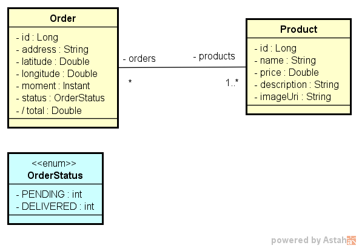
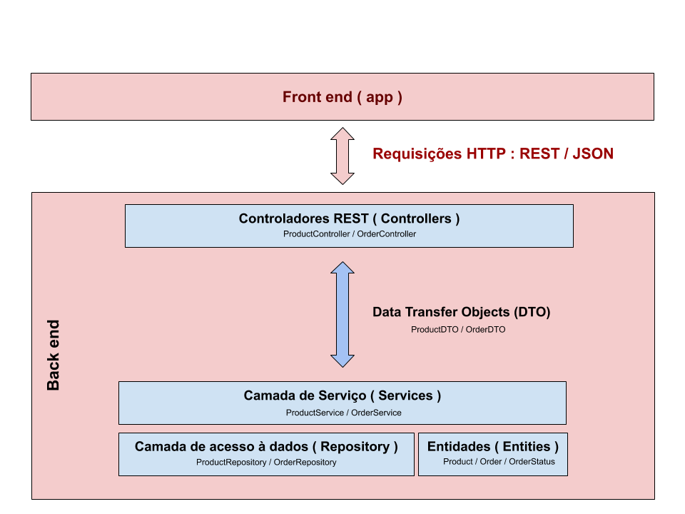
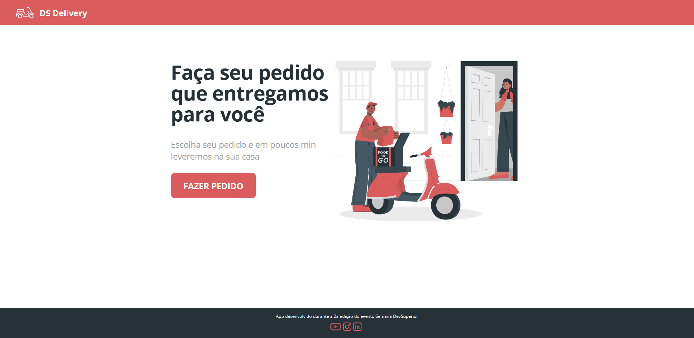
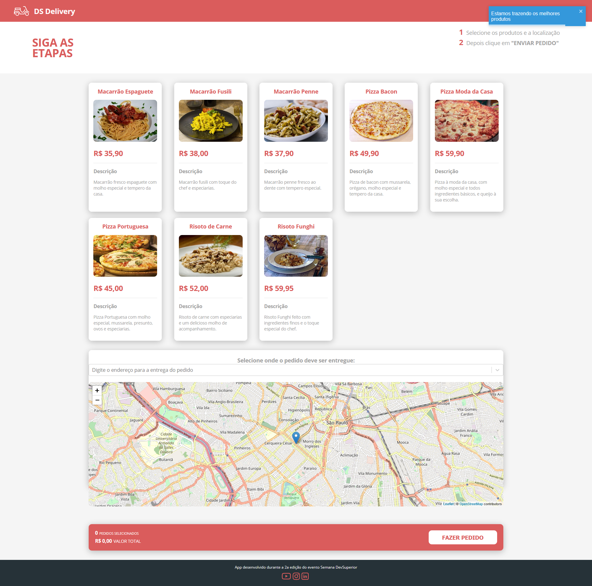
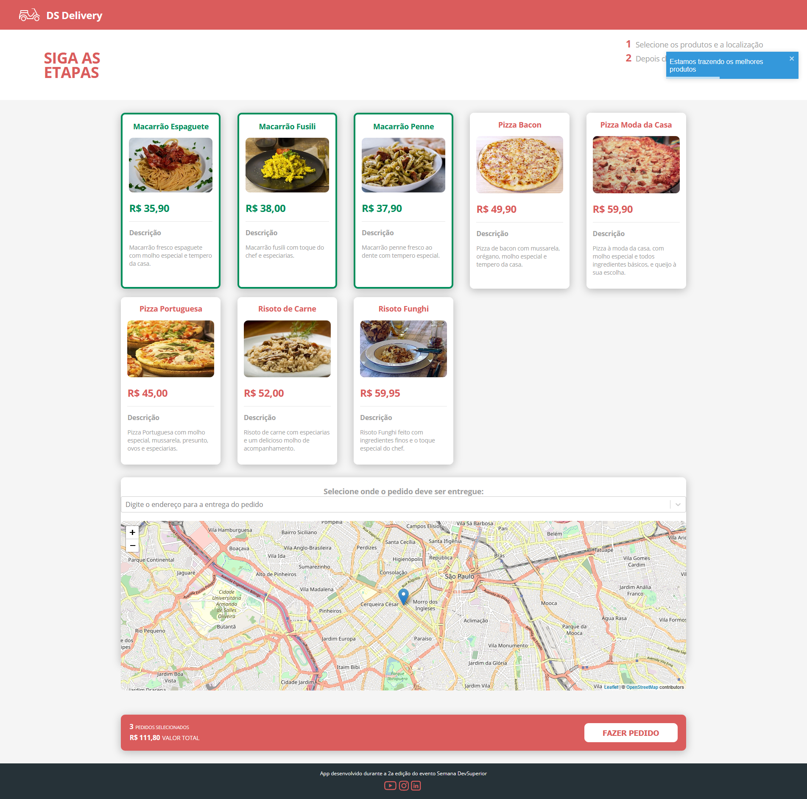
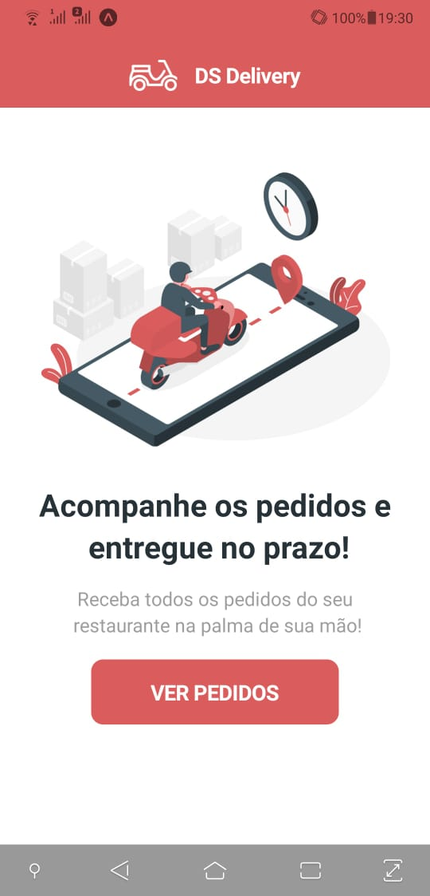
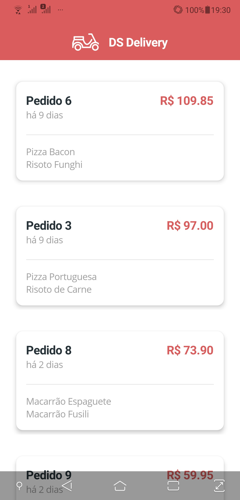
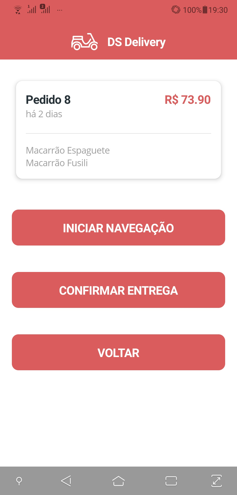

# SemanaDevSuperior2
Sistema de delivery de pedidos. Aplicação completa desenvolvida durante o evento na edição 2 com SpringBoot, React, React Native e PostgreSQL.

<p align="center">
  <a href="#sobre">Sobre o Projeto</a>&nbsp;&nbsp;&nbsp;|&nbsp;&nbsp;&nbsp;
  <a href="#conceitual">Modelo Conceitual</a>&nbsp;&nbsp;&nbsp;|&nbsp;&nbsp;&nbsp;
  <a href="#pattern">Padrão de camadas adotado</a>&nbsp;&nbsp;&nbsp;|&nbsp;&nbsp;&nbsp;
  <a href="#tools">Tecnologias Utilizadas</a>&nbsp;&nbsp;&nbsp;|&nbsp;&nbsp;&nbsp;
  <a href="#backend">Back end</a>&nbsp;&nbsp;&nbsp;|&nbsp;&nbsp;&nbsp;
  <a href="#api">API</a>&nbsp;&nbsp;&nbsp;|&nbsp;&nbsp;&nbsp;
</p>

<h2 id="conceitual"> 🗺️ Modelo Conceitual</h2>

<h1 align="center">
    
</h1>

<h2 id="pattern"> 🛡️ Padrão de camadas adotado</h2>

<h1 align="center">
    
</h1>

<h2 id="tools"> 🛠️ Tecnologias Utilizadas</h2>

- [JDK11]('https://www.oracle.com/br/java/technologies/javase-jdk11-downloads.html')
- [STS - Spring Tools Suite]('https://spring.io/tools')
- [Postgres 12 e pgAdmin]('https://www.postgresql.org/download/')
- [Heroku CLI]('https://devcenter.heroku.com/articles/heroku-cli')

<hr>

<h2 id="pattern"> 🖼️ Imagens do Projeto </h2>
</br>
<h2 align="center">Aplicação WEB</h2>
</br>
<h1 align="center">
    
    
    
</h1>
</br>
<h2 align="center">Mobile</h2>
</br>
<h1 align="center">
    
    
    
</h1>

<h2 id="backend"> 🧰 Backend</h2>

<h4> 🔨 Tecnologias</h4>

* Java
* PostGreSQL ( Banco de Dados de Produção )
* H2 ( Banco de Dados de Testes )

<h4> ⚙️ Dependências</h4> 

* Spring Boot
  * Starter Web 
  * Starter Data JPA ( Mapemaneto Objeto Relacional )
  * Starter Validation
  * Starter Security
  * Starter Test
* H2 ( Banco de Dados em memória. Usado nos testes da aplicação )
* PostGreSQL 

<h4 style="font-weight:bold"> ⚙️ Arquivos de Configuração</h4> 

Arquivo                      | Tipo de Configuração
---------------------------  | ------
application.properties       | Configurações Gerais
application-test.properties  | Configurações para Testes
application-dev.properties   | Configurações para Desenvolvimento
application-prod.properties  | Configurações para Produção

</br>
<h4> ⚙️ Local dos Arquivos de Configuração</h4>

```bash
# Local dos arquivos 
|- /dsdelivery
  |- src/main/resources
    |- application.properties
    |- application-test.properties
    |- application-dev.properties
    |- application-prod.properties
```    

<h2>application.properties</h2>

```properties
# Seta o profile que ficará ativo
spring.profile.active=test    

# Restringe o uso do jpa até a camada de serviço não podendo ser usado para acesso aos dados
# na camada de controladores REST
spring.jpa.open-in-view=false
```

<h2>application-test.properties</h2>

```properties
# Caminho para conexão com o banco de testes
spring.datasource.url=jdbc:h2:mem:testdb 

# usuario do banco de testes
spring.datasource.username= <informar_usuario> 

# senha do banco de testes
spring.datasource.password= <informar_senha> 
```

<h2>application-dev.properties</h2>

```properties
# Rotinas comentadas são para gerar o script de criação do Banco de Dados
#spring.jpa.properties.javax.persistence.schema-generation.create-source=metadata
#spring.jpa.properties.javax.persistence.schema-generation.scripts.action=create
#spring.jpa.properties.javax.persistence.schema-generation.scripts.create-target=create.sql
#spring.jpa.properties.hibernate.hbm2ddl.delimiter=;

spring.datasource.url=jdbc:postgresql://localhost:5432/dsdelivery
spring.datasource.username=postgres
spring.datasource.password=1234567

spring.jpa.properties.hibernate.jdbc.lob.non_contextual_creation=true
spring.jpa.hibernate.ddl-auto=none

```

<h2>application-prod.properties</h2>

```properties
# Caminho da Base de Dados de Produção
spring.datasource.url=${DATABASE_URL}
```
</br>
<h2 style="font-weight:bold"> 🔚 End Points da API</h2> 

<h3 style="font-weight:bold"> API de Produtos </h3>

| Route             | Response Formats | Resource URL                                 |  Parameters |
|-------------------|------------------|----------------------------------------------|-------------|
| GET  /products    | JSON             | http://localhost:8080/products               | None        |

</br>

| Route             | Description                                                                    |
|-------------------|--------------------------------------------------------------------------------|
| GET  /products    | Retorna uma lista de todos os Produtos ordenados pelo Id em ordem ascendente   |

</br>
<h3 style="font-weight:bold">API de Pedidos</h3>

| Route             | Response Formats | Resource URL                                 |  Parameters |
|-------------------|------------------|----------------------------------------------|-------------|
| GET  /orders      | JSON             | http://localhost:8080/orders                 | None        |
| POST /orders      | JSON             | http://localhost:8080/orders                 | JSON Body   |
| PUT  /orders      | JSON             | http://localhost:8080/orders/{id}/delivered  | Id Order    |

</br>

| Route             | Description                                                                   |
|-------------------|---------------|
| GET  /orders      | Retorna todos os Pedidos de status 'PENDING' juntamente com os produtos em ordem Ascendente |
| POST /orders      | Efetua a gravação do Pedido no Banco de Dados juntamente com os Produtos selecionados |
| PUT  /orders      | Atualiza o status do Pedido para 'DELIVERED'               |

</br>
<h3 style="font-weight:bold">POST /orders ( Formato de envio do Pedido )</h3>

```json
{
    "address": "Avenida Paulista, 1500",
    "latitude": -23.56168,
    "longitude": -46.656139,
    "products": [
        {
            "id": 2
        },
        {
             "id": 5
        }
     ]
}
```

</br>